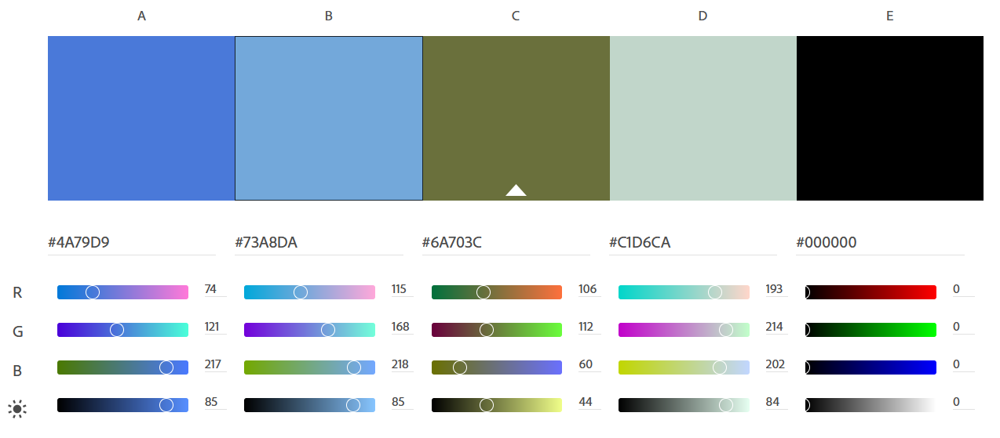
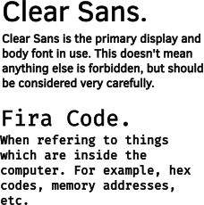

# Logo, Color, and Typography

## Logo Design and Usage

The rebma.io logo is designed to meet the following requirements:

1. Reproducible with limited color palette
2. Clear contrast for reproduction at lower resolutions (such as PCB)

Where possible, the [SVG version](rebma-io-logo.svg) of the logo should be used;
however, a high resolution [PNG version](rebma-io-logo.png) is also provided.

## Design Colors

The following design palette is chosen for all applications:

Their usage can be best described below:

|Color|Usage|RGB (hex)| In Palette Above|
|--|--|--|--|
|Black|Primary color for text, etc.|#000000|E|
|Olive green|Dark accent|#6A703C|C|
|Light blue-green|Light accent|#C1D6CA|D|
|Medium blue||#4A79D9|A|
|Light blue||#73A8DA|B|

Included is a GIMP/Inkscape [color palette](rebma-io-color-palette.gpl).

## Font Choices

All text and display fonts shall be [Clear
Sans](https://github.com/intel/clear-sans), which was originally created by
Intel, and is licensed under the Apache License version 2.0. 

All code or other monospace requirements shall use [Fira
Code](https://github.com/tonsky/FiraCode), which is licensed under the Open Font
License v1.1.

A sample of the use of those fonts is shown here:

