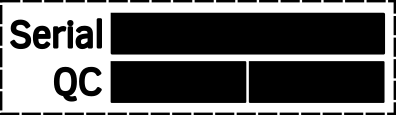

# PCB Standards

## General PCB Standards

Unless something else requires it, the specs of the PCB should be:

* 1.6mm thickness
* Black solder mask
* HASL (lead)
* 1oz copper
* No order number

## Port Labeling

All connectors which represent ports to other things, whether "internally" to
the product or for use by someone else, must be labeled clearly with their
intended use in a human-readable size and text. For example, if the board
soldermask were white, this would be the correct design: 

The label should be at least 5mm high.

## Font Sizing

The font size and line width of the silkscreen text depend on the type of
silkscreen method used for its application. For standard silkscreen printing,
you should use as large of font size and line width as possible without going
smaller than a 50 mil font size and a 7 mil line. LPI can go down to 4 mil line
widths, while direct printing can go down to 3.

## Serial/Quality Control Markings

The following markings should be on every PCB, ideally on the top of the board,
but potentially on the bottom if that better allocates space. The serial number
can be written in, and the QC is filled in with initials and a date
(YYYY-MM-DD). 

All markings are made using an [Edding 8404
marker](https://www.edding.com/products/edding-8404-aerospace-marker/). This is
a 0.75mm tip permanent marker that has low-corrosion and permanent water-based
ink that is solvent resistant.

## Checklist

Use the following checklist for every design as part of a board release process.

* Name of the thing
* Logo(s) applied (OSHW and rebma.io)
* Part number w/version applied
* Serial/QC marking applied
* Reference designators (see ASME Y14.44-2008 and IEEE Std 315)
* All ports labeled with human-readable marking (see Ports)
* All ports labeled with pinouts
* Pin 1 indicated on all ISCs of a small dot.
* Polarity indication for
  * Power & ground
  * Polarized capacitors
** Diodes
* Component outlines
* Values for all passives
* Probe points
* Switch settings

TODO: Create formal board release process and link here.